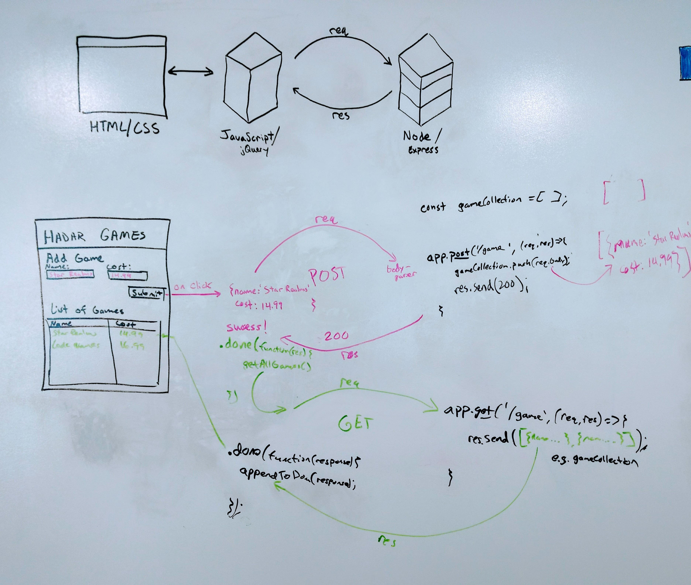

# ROUTER ACTIVITY

Use the setup instructions below to get this app up and running. After you confirm everything is working correctly, move the `GET` and `POST` server side code into a **routes/game.router.js** file. Test the app after moving the code to confirm everything still works as expected.

## Game Collection

Web application that collects `name`, and `cost` via input fields on the client and sends the data to a server. The server stores the data and returns the games as a list to the client.

### Setup

Fork and clone this repository. Run `npm install` to install express and body-parser. Start the server with `npm start`.

### Technologies

J.E.N. Stack

- jQuery
- Node.js
- Express
- HTML / CSS
- AJAX

### Diagram

### Types of Requests

Type | a.k.a. | Description
--- | --- | ---
POST | CREATE | Send data to the server.
GET | READ | Requests data. This can be tested in the browser.
